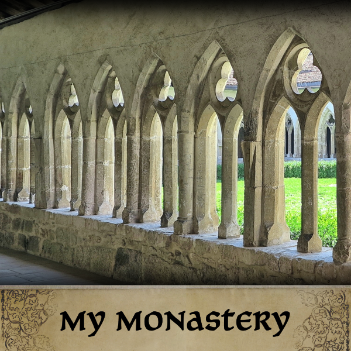

# MyMo
My Monastery (MyMo) is a mod for CK3 that adds an additional holding type : a monastery

## Player install

There is 2 means to install the mod. Click on subscribe of one these 2 stores :
- [Paradox Mods](https://mods.paradoxplaza.com/mods/14482/Any)
- [Steam workshop](https://steamcommunity.com/sharedfiles/filedetails/?id=2260384841])

## Contributor install

If you want to edit the mod :
- [Fork this repository](https://docs.github.com/en/free-pro-team@latest/github/getting-started-with-github/fork-a-repo)
- Clone your fork on your computer
- Run create_symbolic_link.bat on Windows or create_symbolic_link.sh on Linux (or Mac).
In case of error, you should edit the script to adapt the *modDir* variable to your setup.

Do not hesitate to contact us via Steam, Paradox Forum or Discord to contribute for a long time.

You can also contribute by creating issues.

## Mod changes

A changelog of the mod is available in [this file](MyMo/Changelog_MyMo.txt).

If you want to see the changes in terms of files, you can see [here](https://github.com/ArkoG/MyMo/compare/paradox...main).

## Credits
- Arko : creator of the mod
- Mouchi : contributor and git maintainer
- MattAlexi : creator of the monastery 3D model
