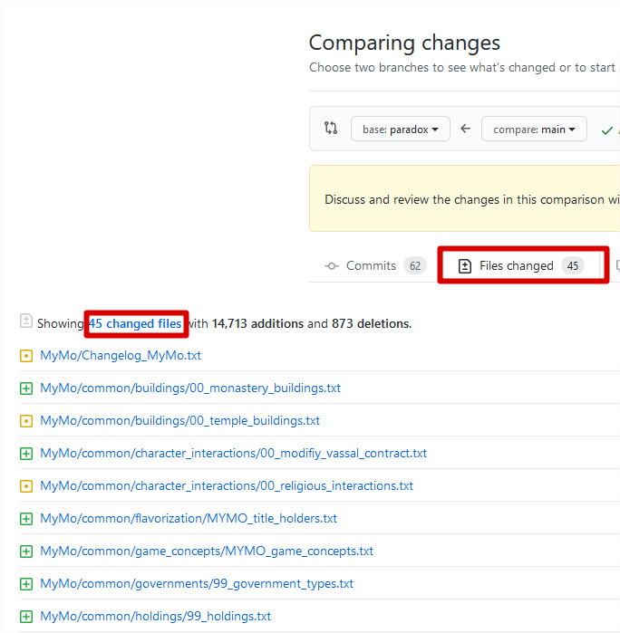

# Update Paradox Files

### Motivation
The modding restrictions force us to edit some game files.
These game files are edited by Paradox Development Studio.
Then our modifications of these files need to be updated to each Paradox file.

The *paradox* branch's goal is to help to update the edited Paradox files.
This file will show how to do.

### Add edited Paradox files to the paradox branch
When Paradox release a patch of CK3, DO NOT UPDATE YOUR GAME YET !

Check the edited files by the mod by going to [this link](https://github.com/ArkoG/MyMo/compare/paradox...main) and seeing the files list by cliking on area with red rectangle in the following image.


Pay attention to added files (green + before their names).

If you recognize Vanilla files, commit and push them in the *paradox* branch.

Go to the *main* branch and merge the *paradox* branch.

### Update the paradox files
When you have finished adding all edited paradox files (see previous section), you should now update your game.

To update the paradox files you can use a homemade Python script.
You need to install Python 3. You can do it by installing [Miniconda](https://docs.conda.io/en/latest/miniconda.html).

When done, you can create a script file (.bat on Windows, .sh on Linux) with the following command to run the Python script.
```
"<path_to_python>\python" update_source.py "<path_to_steam>\Steam\steamapps\common\Crusader Kings III\game" "<path_to_github>\GitHub\MyMo\MyMo"
```

Example of a more complete .bat file:
```
@echo off
C:\Users\Nicolas\Miniconda2\python update_source.py "D:\Programmes\Steam\steamapps\common\Crusader Kings III\game" D:\Documents\GitHub\MyMo\MyMo
pause
```

The double quotes are used to manage arguments with spaces.

After running the script, if there is no error you will see the changes in your git application (for example [GitHub Desktop for Windows](https://desktop.github.com/)).

Commit and push the changes.

Go to the *main* branch and merge the *paradox* branch.
